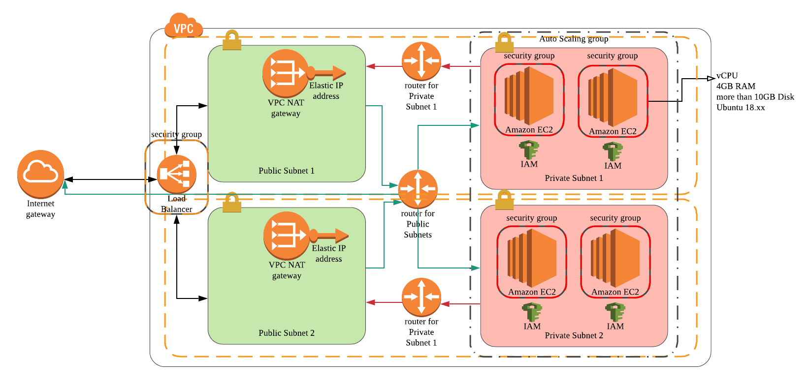

# cloud-formation-project

This is an assignment project for [Udacity Cloud Devops Nanodegree](https://www.udacity.com/course/cloud-dev-ops-nanodegree--nd9991).
CloudFormation templates in this repo deploys AWS resources shown in the chart below.
( S3 bucket is already offered in project requirements.)
<br><br>



To deploy the resources, run the commands below in order.
```
# Deploys basic nework resources such as VPC, subnets, NAT/Interget gateway and router etc.
$ sh create_stack.sh Udagram-network network/network.yml network/parameter.json
```

```
# Deploys security group for each instance in subnets.
$ sh create_stack.sh Udagram-SG servers/security_group.yml servers/parameter.json
```

```
# Deploys Load Balancer which sends user-end traffic to target instances.
$ sh create_stack.sh Udagram-LB servers/load_balancer.yml servers/parameter.json
```

```
# Deploys Lanunch Configuration & Auto-Scaling group applied to instances in private subnets.
$ sh create_stack.sh Udagram-AS servers/auto_scaling_group.yml servers/parameter.json
```


